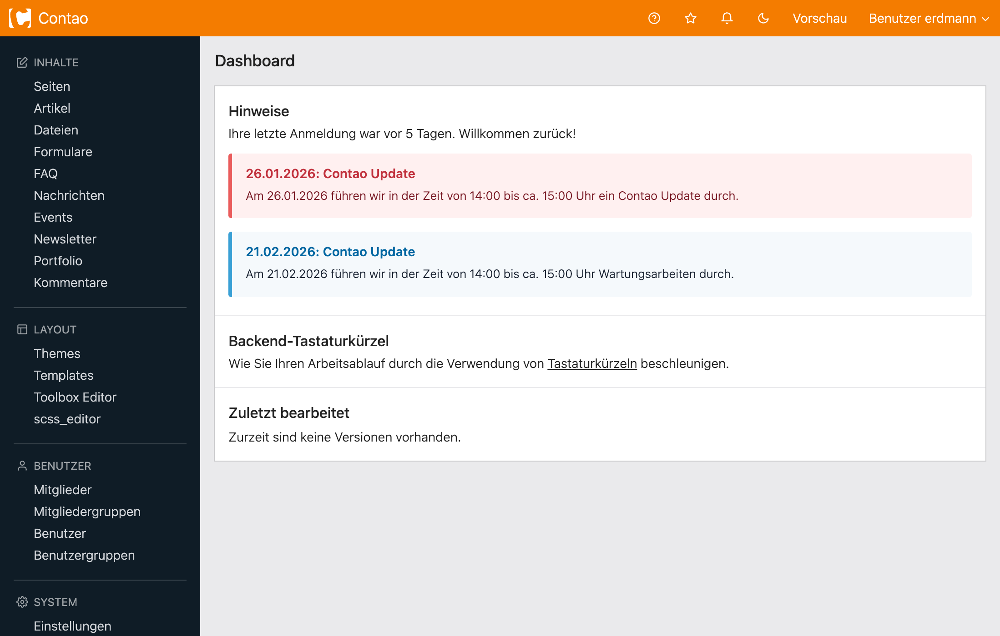

# Contao Status-Updates Bundle

Zeige wichtige Status-Updates wie anstehende Contao Updates im Contao Backend-Dashboard an.

## Funktionen

- **Backend-Modul**: Verwalte Status-Updates über das Menü "Status-Updates" im Backend
- **Datumsbasierte Sichtbarkeit**: Steuere, wann Updates erscheinen (X Tage vor/nach einem Ereignis)
- **Rich-Text-Editor**: TinyMCE-Integration für detaillierte Beschreibungen
- **Dashboard-Widget**: Automatische Anzeige im Backend basierend auf Sichtbarkeitsregeln
- **Flexible Anzeigeregeln**: Konfiguriere, wie lange Updates sichtbar bleiben
- **Farbcodierte Anzeige**: Visuelle Indikatoren für bevorstehende, aktuelle und vergangene Ereignisse
- **Abgeschlossen-Status**: Markiere Updates als erledigt – das Dashboard zeigt sie dann grün mit einem Häkchen-Hintergrund-Icon
- **E-Mail-Benachrichtigung**: Sende beim Abschließen eines Updates automatisch eine Mail an ausgewählte Backend-Benutzer (siehe Abschnitt "Benachrichtigungen")

## Installation

Installation über Composer:

```bash
composer require erdmannfreunde/contao-status-update-bundle
```

## Verwendung

### Status-Updates erstellen

1. Navigiere zu **Backend → System → Status-Updates**
2. Klicke auf "Neu", um ein Status-Update zu erstellen
3. Fülle die Felder aus:

- **Titel**: Kurzer beschreibender Titel
- **Beschreibung**: Detaillierte Informationen (unterstützt HTML über TinyMCE)
- **Ereignisdatum**: Das Datum des Ereignisses
- **Benachrichtigung vor Ereignis anzeigen**: Wie viele Tage vor dem Ereignis das Update angezeigt werden soll
  - 7 Tage vorher (Standard)
  - 10 Tage vorher
  - 30 Tage vorher
  - Nur am Ereignistag
- **Benachrichtigung nach Ereignis anzeigen**: Wie viele Tage nach dem Ereignis das Update weiterhin angezeigt werden soll
  - Nur am Ereignistag (Standard)
  - 1 Tag danach
  - 7 Tage danach
- **Veröffentlicht**: Aktivieren, um im Dashboard sichtbar zu machen
- **Abgeschlossen**: Markiert das Update als erledigt. Im Dashboard wird es dann grün dargestellt und erhält ein dezentes Häkchen-Icon im Hintergrund. Lässt sich auch direkt aus der Übersicht über das Checkbox-Icon umschalten.

4. Speichere das Status-Update

### Dashboard-Anzeige



Status-Updates erscheinen automatisch im Backend-Dashboard basierend auf den Sichtbarkeitsregeln:

- **Rot/Wichtig**: Ereignisse, die heute stattfinden
- **Gelb/Warnung**: Ereignisse innerhalb der nächsten 3 Tage
- **Blau/Info**: Zukünftige Ereignisse
- **Grün/Erfolg**: Vergangene Ereignisse (innerhalb der "Danach"-Anzeigedauer) sowie als **abgeschlossen** markierte Updates (zusätzlich mit Häkchen-Hintergrund-Icon)

## Sichtbarkeitslogik

Das Bundle berechnet, welche Status-Updates angezeigt werden, basierend auf:

1. **Aktuelles Datum** vs. **Ereignisdatum**
2. **Vorher anzeigen**-Einstellung (wie viele Tage im Voraus)
3. **Danach anzeigen**-Einstellung (wie viele Tage nach dem Ereignis)

Beispiel: Wenn du "7 Tage vorher" und "1 Tag danach" für ein Ereignis am 15. Januar einstellst:

- Das Status-Update wird ab dem 8. Januar angezeigt
- Das Status-Update wird nach dem 16. Januar nicht mehr angezeigt

## Benachrichtigungen

Beim Markieren eines Status-Updates als **abgeschlossen** kann das Bundle automatisch eine E-Mail an ausgewählte Backend-Benutzer versenden.

### Einrichtung

Die Einstellungen sind über das Zahnrad-Icon oben rechts in der Status-Updates-Übersicht erreichbar (keine eigener Sidebar-Menüpunkt).

Verfügbare Felder:

- **E-Mail-Benachrichtigung aktivieren**: Master-Schalter. Wenn aus, wird nichts versendet.
- **Betreff**: Betreff der Mail. Unterstützt die Platzhalter `##title##`, `##date##`, `##description##`.
- **Nachricht**: HTML-Body der Mail (TinyMCE). Unterstützt dieselben Platzhalter sowie Contao-Insert-Tags.
- **Empfänger**: Mehrfach-Auswahl aller Backend-Benutzer. Der aktuell angemeldete Benutzer wird **immer automatisch** ergänzt – auch wenn niemand sonst angehakt ist.

### Verhalten

- Der Versand läuft pro Status-Update **genau einmal** (Flag `notification_sent`). Auch wenn der Status zwischendurch wieder geöffnet und erneut abgeschlossen wird, geht keine zweite Mail raus.
- Der Versand erfolgt über die in Contao konfigurierte Standard-Versandart (Symfony `MailerInterface`, gesteuert über `MAILER_DSN`).
- Als Absenderadresse wird die unter „System → Einstellungen → Administrator-E-Mail-Adresse" hinterlegte Adresse verwendet.
- Backend-Benutzer ohne hinterlegte E-Mail-Adresse oder mit ungültiger Adresse werden übersprungen.
- Insert-Tags in den Settings (z.B. `{{date}}`) werden ausgewertet; Insert-Tags in nutzergenerierten Status-Update-Feldern (Titel/Beschreibung) werden bewusst **nicht** ausgewertet, um eine Insert-Tag-Injection durch Editoren mit eingeschränkten Rechten zu verhindern.

## Anforderungen

- PHP 8.2 oder höher
- Contao 5.3 oder höher
- Symfony 6.4 oder 7.0

## Lizenz

Dieses Bundle ist unter LGPL-3.0-or-later lizenziert.
